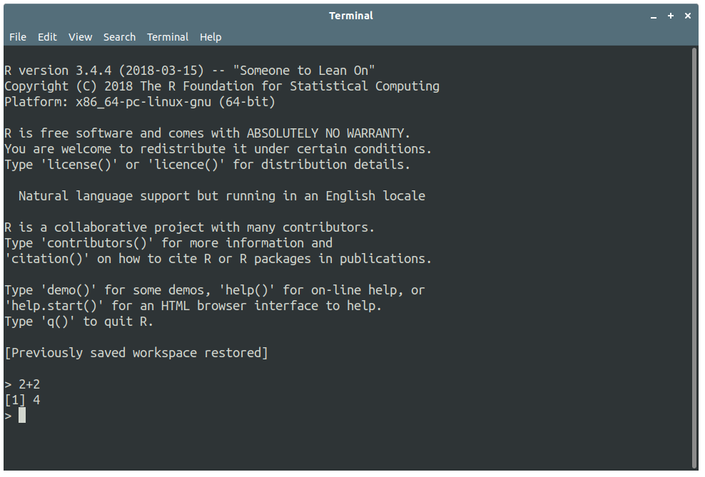
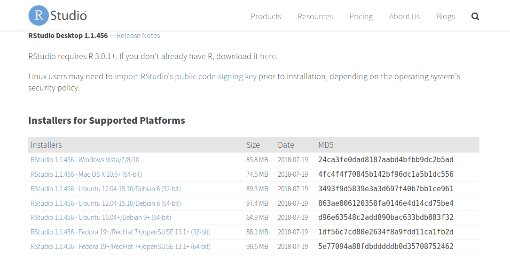
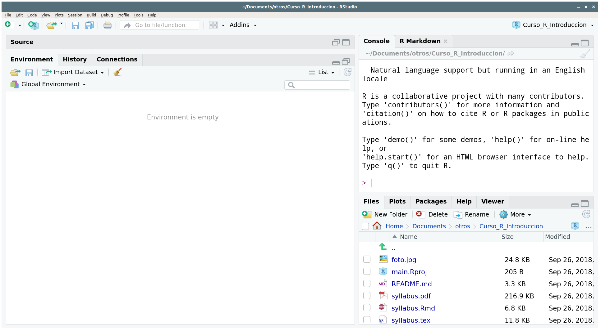

# Instalar `R`

## Paso 1: Abrir el espejo 

Para proteger `R`, su contenido está disponible en *mirrors* alrededor del mundo. Este sistema de resguardo y distribución de `R` (y sus paquetes) se llama *The Comprehensive R Archive Network*.

Para descargar `R` hay que usar uno de estos espejos, el más cercano es el del ITAM: [https://cran.itam.mx/](https://cran.itam.mx/) (Da clik en la liga).

## Paso 2: Descargar `R` para nuestro sistema operativo

En la página del espejo hay que seleccionar nuestro sistema operativo, descargar e instalar `R`.

## `R` en estado salvaje

El programa en estado salvaje se ve como la *Figura 2* (en Ubuntu). Como una consola. Afortunadamente, hay formas más agradables de trabajar con este lenguaje.

{ width=60% }

# Instalar *RStudio*

## Paso 1: Entra a la parte de descargas de *RStudio*

Da clic (o copia a tu explorador) a esta dirección: [https://www.rstudio.com/products/rstudio/download/#download](https://www.rstudio.com/products/rstudio/download/#download)

## Paso 2: Descargar *RStudio*

En la sección *Installers for Supported Platforms* selecciona tu sistema operativo, descarga, abre y sigue las instrucciones del instalador.

{ width=80% }

## *RStudio* como interfaz gráfica

Esta interfaz nos permitirá usar con mayor comodidad el lenguaje.

{ width=80% }

# Instalar \LaTeX

## Advertencia

Este proceso puede ser engorroso por las diferencias en sistemas operativos.

- Si usas MAC OS, instala MACTEX, de esta liga: 
[http://www.tug.org/mactex/mactex-download.html](http://www.tug.org/mactex/mactex-download.html)

- Si usas Windows, instala MIKTEX, de esta liga: [https://miktex.org/howto/install-miktex](https://miktex.org/howto/install-miktex)

- Si usas una distro de Linux como Ubuntu usa TEXLIVE de esta liga: [https://www.tug.org/texlive/](https://www.tug.org/texlive/)