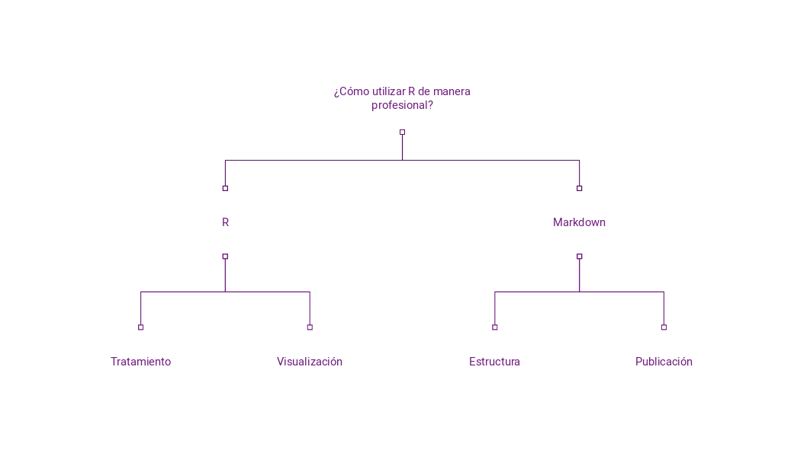

# Estructura general del curso

Este curso se inspira del trabajo diario y profesional con `R`; es decir, el curso no se contruye en mejorar dramáticamente sus habilidades en pensamiento computacional o en conocimiento estadístico, sino el uso de este lenguaje para hacer de su trabajo diario algo mucho más rápido, más estructurado y más eficiente.

Por tanto, la estructura del curso se encuentra presentada en la siguiente figura.

{ width=120% }

Los temas que cubriremos están descritos en el syllabus.


# Estructura de la clase

Las sesiones durarán, efectivamente 3 horas. La hora restante es par aun pequeño brake de 30 minutos (o como convenga el grupo) y la última media hora será para resolever un ejercicio. Aquí quienes quieran quedarse a resolverlo juntos nos quedamos y quien se quiera o tenga que ir, puede hacerlo con la confianza de que no veremos material nuevo.


# ¿Qué es Markdown?

*Markdown* (*MD*) es un lenguaje de *marcado*, su terminación comúnmente es `.md`. Sin embargo, nosotros usaremos una versión"con sabor" (*flavored*) a `R`, con terminación `Rmd`. Esto significa que *MD* no sirve para programa o procesar datos. Simplemente nos permite estructurar, escribir y presentar. Este elnguaje es muy popular, incluso *WhatsAPP* lo usa. Prueba escribir en tu *WhatsAPP* lo siguiente: ` ```Te mando mi código, *es muy importante* e=mc^2``` `.

Como pueden ver, *MD* es tan útil porque permite identificar y enfatizar cuando las cosas son códigos o instruir a la computadora a cambiar el tipo de letra con base en el código. Sin clics de más, sin problemas de edición y sin depender de software como *MS Office*.


# ¿Por qué empezar por *MD* y no por `R`?

1. Porque uno de los grandes retos del aprendizaje profesional en `R` es saber *cómo usarlo* en un contexto profesional. Yo creo, es debatible supongo, que de nada sirve poder hacer redes neuronales convolusionales (cosa muy cool y posible en `R`), si no podemos comunicarlo y entenderlo en un contexto del día a día.

> En *STATA* por ejemplo, no se pudo usar *MD* para crear documentos desde este software hasta su última versión. Además, [si se meten tantito](https://www.stata.com/new-in-stata/markdown/), verán que es un problema. La distancia entre hacer un análisis en *STATA* o en *SPSS* o en *SAS* y presentarlo es larga. Gracias a *MD*, ésta no sólo se reduce si no que hace documentos que no sólo por ser técnicos se vean como salidos de una impresora de matriz.

2. Porque permite estructurar nuestro pensamiento para resolver problemas. Para construir efectivamente un documento en *MD* necesitamos conocer con antelación la estructura. Esto nos ahorrará mucho tiempo y nos permitirá partir todos los problemas que tenemos en pequeñas partes. Escribir un documento, por ejemplo, es un problema. Piensen en su tesis o en algún reporte. Escribir con una estructura permite que ese gran problema se resuelva en pequeñas ideas.


# ¿Cómo usar *MD*?

Para estas alturas, ya pudieron haberse dado cuenta de que un archivo `Rmd` es, finalmente, un archivo de texto con algunas instrucciones que le indican a nuestra computadora cómo construir un documento, pero vez de usar clics de nuestro ratón usamos instrucciones escritas. De esta forma, que funcione o no nuestro documento está en función del código y no de los clics que demos. Así, un documento *MD* en el sabor de `R` se compone de 3 elementos:

\vspace{5mm}


1. Un *YAML*: Antes que **cualquier** cosa, es necesario crear un "encabezado" que indique qué queremos que sea nuestro documento. Un *YAML* correcto debe indicar el título, la persona autora, la fecha y qué se espera que sea el resultado. *MD* puede producir documentos en *HTML*, *PDF* (vía \LaTeX) y *MS WORD* (para los que les guste la mala vida).

\vspace{5mm}


```{markdown}
---
title: "El mejor reporte de la historia"
author: "Manuel Toral"
date: "Septiembre 29, 2018"
output: html_document
---
```

\vspace{5mm}

2. Una estructura. Las estructuras en *MD* se componen por el "signo de gato" `#`. Un `#` indica la primera estructura, `##` indica una estructura "hija" o dependiente, un `###` indica una estructura dependendiente de la anterior... y así. Por ejemplo:

\vspace{5mm}

```{markdown}
# Así se ve un título

## Así se ve un subtítulo
Este es el contenido de esta sección.

### Así se ve un subsubtítulo
Este es otro contenido de esta sección.
```

\vspace{5mm}

# Así se ve un título

## Así se ve un subtítulo
Este es el contenido de esta sección.

### Así se ve un subsubtítulo
Este es otro contenido de esta sección.


\vspace{5mm}

3. Una serie de instrucciones contenidas en **chunks** de código. un **chunk** es un espacio en el que *MD* reconoce que lo que se encuentre dentro va a ser una instrucción en algún lenguaje de programación. Todo lo que se encuentre dentro va a ser considerado parte de ese lenguaje y correrá en nuestro consola como instrucciones. **Esta características es la más poderosa y útil de *MD***. Para abrir un **chunk** ahy que abrir y cerrar. Nunca dejar abierto, nunca olvidar alguna de estas partes. Así, para escribir un pedazo de código debemos encerrarlo en medio de estas dos llaves: ` ```{r nombre_del_chunk} ` y ` ``` `, donde `r` se refiere al lenguaje que estemos usando. 

Al encerrar nuestro código en estas dos llaves, todo lo que se encuentre dentro correrá en nuestra consola y se imprimirá el resultado correspondiente.

```{r mi primer chunk}
print("Hola Mundo")
plot(pressure)

library(tidyverse)
ggplot(pressure, aes(temperature, pressure)) +
  geom_point()
```
Estos chunks tienen varias características que podemos "prender" y "apagar" según nuestras necesidades. Puede ser que no queramos que nuestro público objetivo vea nuestors códigos o a la perosna interesada solo le importa el resultado. Tambiéne stá la posibilidad de que querramos compartir nuestros códigos, pero haya algo que no esta funcionando. Para eso de utilizan las opciones `echo=`, `eval=`, `warning=`, `message=`. Estas opciones también nos permiten cambiar el tamaño y alineación de nuestras gŕaficas con opciones como `fig.align=`, `fig. width=`, `fig.height=`, etc.


```{r caracteristicas chunk, eval=TRUE, echo=FALSE, message=FALSE, warning=FALSE}
print("Hola Mundo")
plot(pressure)
```


Los códigos también se puede poner"inline" (en la línea de texto) si seponen entre ` ` `, por ejemplo, digamos que queremos reportar las estadísticas descriptivas de una variable. Una forma es con un chunk:

```{r mtcars descriptivas}
summary(mtcars)
```

¿Cuál es la media de la variable *mpg*?

```{r media mpg}
mean(mtcars$mpg)
```

Entonces tendríamos que escribir "la media es 20.1".

Pero digamos que nuestro reporte se alimenta de una base que cambia constantemente y se actualiza o que queremos reducir al mínimo el error o humano o simplemente nos da mucha flojera andar corriendo el código,. Para estos casos poder usar exactamente las mismas frases, pero escribir el código **r mean(mtcars$mpg)** rodeado de nuestras viejas conocidas ` ` `.

Así, la oración quedaría:

La media de la variable *mpg* es `r mean(mtcars$mpg)`.

Conforma vayamos avanzando, vamos a ver formas de poner imágenes, links y listas. Es muy sencillo. 


# Ejercicio 
Escribe en un documento de *MD* un reporte breve con la base de datos de tu elección con las siguientes características:

- Título: ¿Cómo se llama tu reporte?

- Dos subsecciones: En una subsección reporta la media y la mediana de tus variables más importantes. En la siguiente, grafica la relación entre dos variables de tu elección.

- Escribe unas oraciones reportanto tus resultados usando codigos *inline*.


